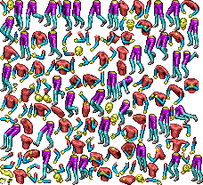
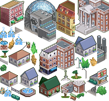
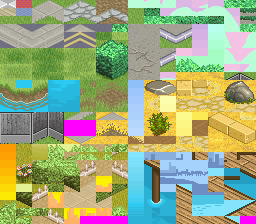

# Recursos do jogo The Sims 3 Java MicroEdition
Este repositório contém arquivos extraídos do jogo The Sims 3 para
celulares java. São imagens png contendo "sprites" do jogo e que foram
descompactados a partir de pacotes .jar de 3 versões do jogo (Normal,
Ambitions e World Adventures).

## Motivação
O objetivo inicial era fazer um "remake" do jogo, usando a própria arte
contida nele, assim não haveria o trabalho de desenhar cada imagem. Novos
recursos seriam adicionados, como multi-jogador online, novos locais, mapas,
mantendo a jogabilidade. Seria como uma extensão do jogo, reescrita em JavaScript
(para execução em navegadores).

## Obstáculos
O grande problema é que as _spritesheets_ estão desorganizadas. O personagem é um
boneco que precisa ser montado e colorido de acordo com a configuração do usuário,
isso também acontece com mobilias e alguns mapas da cidade. Para renderizar o cenário,
é necessário "estudar" as imagens para poder definir o que cada objeto representa, suas
coordenanas e tamanho.

## Sobre o projeto
Detalhes das tecnologias usadas para dar vida ao jogo:
### Linguagens e bibliotecas
JavaScript, com o uso da biblioteca [melonJS](https://melonjs.org) no front-end e NodeJS no back.

> Outras linguagens também podem ser usadas no back-end, desde que se implemente o mesmo
> protocolo de comunicação (como web-socket). Futuramente terá uma documentação detalhada

### Aplicativos
Editores de pixel-art e de _tiles_ (como [Tiled](https://mapeditor.org) ) serão usados para organizar
melhor as imagens e construir cenários personalizados.

# Organização das pastas
Cada pasta contém recursos que estão relacionados entre sí.

### backgrounds
Contém imagens para ser usadas como fundo da interface

### char
Sprites relacionados ao personagem, como corpo, cabelo, acessórios.

### city
Relacionado ao mapa da cidade, como prédios, casas, ruas, árvores.

### events
O que acontece com o personagem, efeitos de fumaça, faíscas...

### ground
São tiles, pequenos quadros com desenho de terra, gramados, calçadas, pisos e paredes.

### icons
Fazem parte do HUD, ícones informativos e indicadores de ações.

### local
Alguns locais têm paredes personalizadas, figurantes e cenários.

### minigames
Ícones dos Mini Jogos (pescaria, jogo da memória...)

### mobile
Tem os móveis da casa, portas e outras decorações.